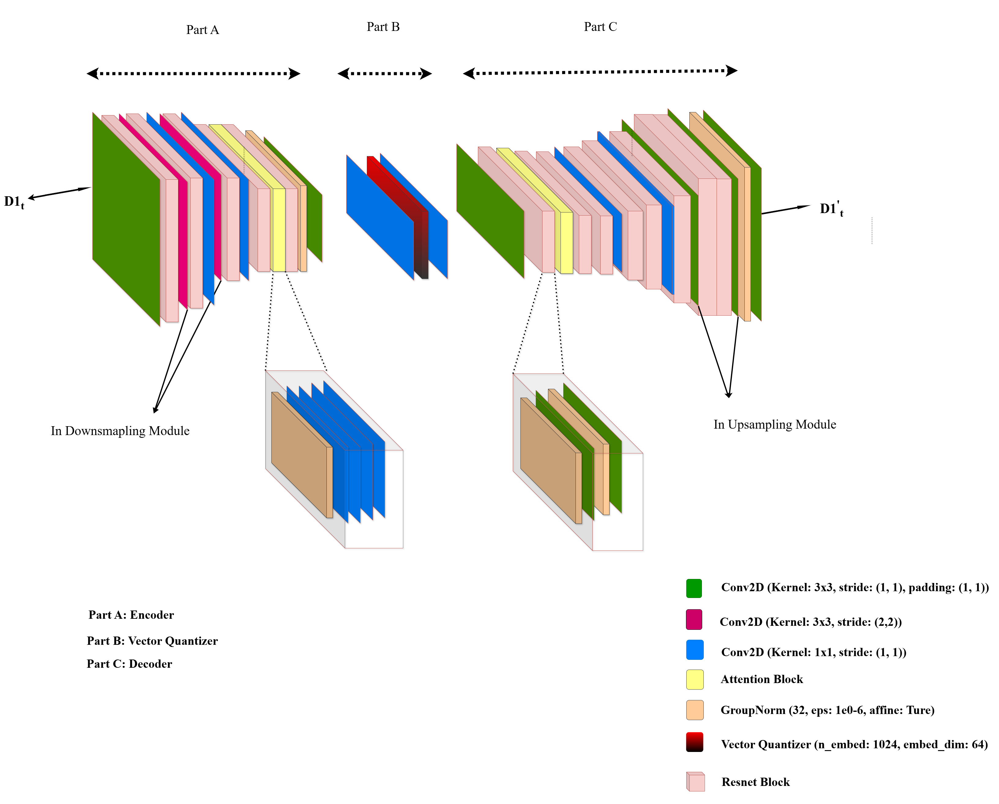
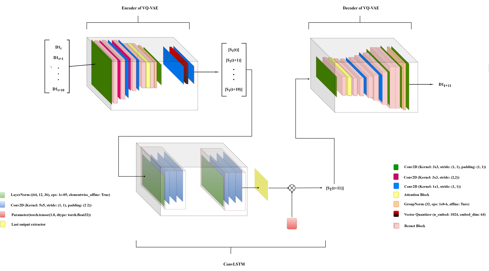

# In Brief

• GISS-Earth data used, GCM of CMIP6 project was utilized to generate the dataset.

• VQ-VAE trained separately for reconstruction task using standard objective function.

• Scaled-Convolutional LSTM network leveraged for temporal modeling of latent tensors corresponding to SST maps.

• Generation of Spatio-temporal data happens while using both trained architectures, simultaneously. See figures for more clarity.

# Figures

<!-- First row: Two side-by-side figures -->
<table>
  <tr>
    <td align="center">
       
      <strong>Figure 1: Reconstruction Task (VQ-VAE)</strong>
    </td>
    <td align="center">
       
      <strong>Figure 2: Temporal Modeling (S-ConvLSTM)</strong>
    </td>
  </tr>
</table>

<!-- Second row: One centered figure -->

   
  <strong>Figure 3: Generation of Data</strong>

